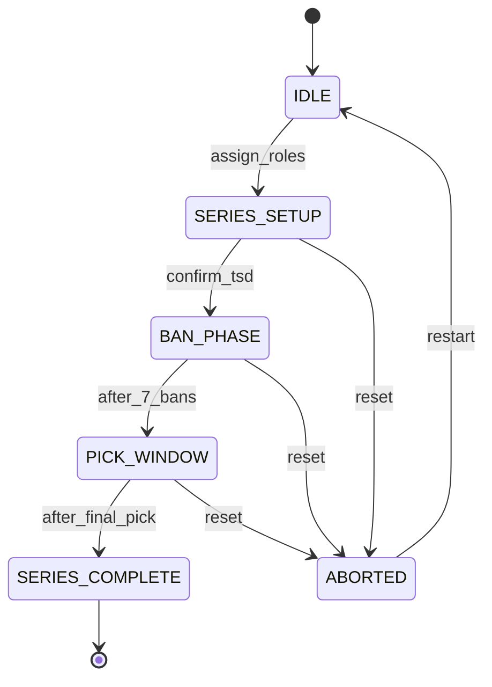
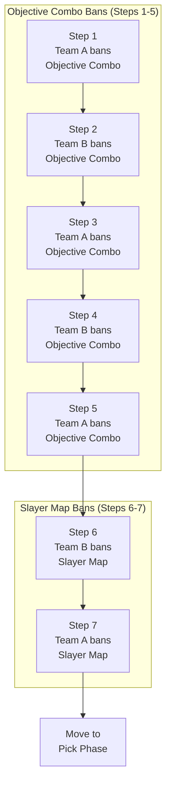
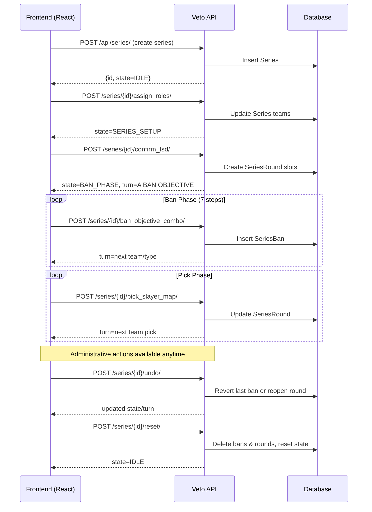

# Architecture

The Veto API backend enforces an HCS-style veto process using a finite state machine (`TSDMachine`).  
All bans/picks are validated at the backend so the frontend only renders and issues API calls.

---

## ⚙️ State Lifecycle

- **IDLE** — fresh series, ready to assign teams
- **SERIES_SETUP** — teams assigned; waiting to confirm Bo3/Bo5/Bo7
- **BAN_PHASE** — executing 7-step ban schedule (Objective combos then Slayer maps)
- **PICK_WINDOW** — teams alternate picks until all rounds are filled
- **SERIES_COMPLETE** — final layout locked and ready for matches
- **ABORTED** — series was reset; can restart from IDLE

---

## 🔄 Ban Schedule (7 Steps)

**Ban Types:**
- **Objective Combo ban** = (Objective Mode + Map) pair — removes specific mode/map combination
- **Slayer Map ban** = (Map) only — removes entire map from Slayer pool

**Pattern:** Teams alternate bans with Team A starting and ending the ban phase.

---

## 🎮 Round Slots per Series Type

### Bo3 Series
**Objective → Slayer → Objective**

### Bo5 Series  
**Objective → Slayer → Objective → Objective → Slayer**

### Bo7 Series
**Objective → Slayer → Objective → Objective → Slayer → Objective → Slayer**

```mermaid
flowchart TD
    subgraph Bo3 ["Bo3 Series"]
        A1["Game 1<br/>Objective<br/>(Team B picks)"] 
        A2["Game 2<br/>Slayer<br/>(Team A picks)"]
        A3["Game 3<br/>Objective<br/>(Team B picks)"]
        A1 --> A2 --> A3
    end
    
    subgraph Bo5 ["Bo5 Series"]
        B1["Game 1<br/>Objective<br/>(Team B picks)"]
        B2["Game 2<br/>Slayer<br/>(Team A picks)"]
        B3["Game 3<br/>Objective<br/>(Team B picks)"]
        B4["Game 4<br/>Objective<br/>(Team A picks)"]
        B5["Game 5<br/>Slayer<br/>(Team B picks)"]
        B1 --> B2 --> B3 --> B4 --> B5
    end
    
    subgraph Bo7 ["Bo7 Series"]
        C1["Game 1<br/>Objective<br/>(Team B picks)"]
        C2["Game 2<br/>Slayer<br/>(Team A picks)"]
        C3["Game 3<br/>Objective<br/>(Team B picks)"]
        C4["Game 4<br/>Objective<br/>(Team A picks)"]
        C5["Game 5<br/>Slayer<br/>(Team B picks)"]
        C6["Game 6<br/>Objective<br/>(Team A picks)"]
        C7["Game 7<br/>Slayer<br/>(Team B picks)"]
        C1 --> C2 --> C3 --> C4 --> C5 --> C6 --> C7
    end
```

**Picking turn rule:** odd-numbered games → **Team B** picks; even-numbered games → **Team A** picks.

---

## ✅ Validation Rules (Highlights)

### During Ban Phase
- **Objective combo bans**: Must specify both Map and Objective Mode
- **Slayer map bans**: Map only, but map must support Slayer mode
- **Turn enforcement**: Teams must alternate (A→B→A→B→A→B→A)

### During Pick Phase
- **Objective picks**: Map must allow the chosen Objective mode; banned Objective combos cannot be picked
- **Slayer picks**: Map must allow Slayer; banned Slayer maps cannot be picked

### Reuse Constraints
- **Slayer maps**: The same map cannot be reused for different Slayer rounds
- **Objective combos**: The exact (Map + Objective Mode) cannot be reused; the map may still be used with a different objective mode

### Administrative Actions
- **undo** — deletes the last ban in BAN_PHASE or reopens the current/previous round in PICK_WINDOW
- **reset** — clears bans/rounds and returns the series to IDLE

---

## 📡 Data Flow (Frontend → Backend)

---

## 🧱 Domain Model (Essentials)

### Core Models

| Model | Purpose | Key Fields |
|-------|---------|------------|
| **Series** | Container for teams, state, and progress tracking | `state`, `round_index`, `ban_index`, `turn` |
| **SeriesBan** | Immutable record of each ban during BAN_PHASE | `series`, `order`, `kind`, `team` |
| **SeriesRound** | Per-game slot (Objective/Slayer) filled during picks | `series`, `order`, `slot_type`, `picked_by` |
| **Action** | Audit log (ban/pick) for exports/analytics | `series`, `step`, `action_type`, `team` |
| **Map** | Registry of available maps | `name`, `modes` (M2M) |
| **GameMode** | Registry of game modes | `name`, `is_objective` |

### State Machine Fields
- `state`: Current phase (IDLE, SERIES_SETUP, BAN_PHASE, PICK_WINDOW, SERIES_COMPLETE, ABORTED)
- `turn`: Active team and expected action type (JSON: `{"team":"A|B","action":"BAN|PICK","kind":"OBJECTIVE_COMBO|SLAYER_MAP"}`)
- `round_index`: Current game being configured (0-based)
- `ban_index`: Current ban step (0-based, max 7)

---

## 🚀 Quick Start

1. **Create Series**: `POST /api/series/` → returns series with `state=IDLE`
2. **Assign Teams**: `POST /api/series/{id}/assign_roles/` → `state=SERIES_SETUP`
3. **Configure Type**: `POST /api/series/{id}/confirm_tsd/` → `state=BAN_PHASE`
4. **Execute Bans**: Follow 7-step ban schedule → `state=PICK_WINDOW`
5. **Make Picks**: Alternate team picks until complete → `state=SERIES_COMPLETE`

Use `undo` and `reset` endpoints for corrections during the process.